# AI-Serving

## 概述
AI-Serving 是一套自洽的智慧服务SaaS平台。

AI-Serving 由两个相互独立的组件构成：AI-Serving OnBoard 和 AI-Serving OnCloud，
* OnBoard组件 是核心计算模块，提供一致的深度神经网络、计算机视觉等算法调用接口
* OnCloud组件 通常部署在中心节点上，是对模型、算法进行管理的模块

且两者均可独立运行。

## 功能概述
#### OnBoard
1. 本地、远程并发执行计算
    * 深度神经网络算法
      * 执行**Tensorflow**系列的通用模型
        * Tensorflow CPU/GPU: `frozen`、`unfrozen`
        * Tensorflow Lite
        * Tensorflow Serving
      * 执行**PyTorch**的通用模型
      * 执行**MXNet**的通用模型
      * 执行**RKNN**的加速芯片模型
      * 执行**猎鹰**的加速芯片模型（电网场景专供）
    * 计算机视觉算法
      * **单帧**的通用算子
      * **帧差法**的通用算子
2. 添加、删除计算模型、算法
3. 增量升级计算模型、算法

#### OnCloud
1. 节点管理：接入私有网络，可以添加多个OnBoard作为OnCloud的计算节点
2. 数据集管理：添加、删除业界标准的`VOC`数据集，并对任意数据集进行标注
3. 目标管理：设定深度学习算法的识别目标
4. 模型管理：管理或下发模型的网络结构、参数、识别阈值和映射标签
5. 模型分析：对已上传的模型在给定数据集进行mAP、漏检、错检、精确度、召回率分析
6. 阈值分析：对回传的现场数据进行阈值分析
7. 人工干预：对识别结果进行手动更正
8. 密钥管理：加密处理上传的模型

## 开发AI-Serving OnBoard
### 代码组织结构
* `src` 目录包括全部源代码
* `build_release.py`、`setup.py` 用来打包二进制程序
* `CHANGELOG` 记录历史修改和添加的功能日志
* `Dockerfile`、`ld.conf` 用于构建容器形态
* `Makefile` 用于构建*GRPC*接口文件

### 构建开发版本
这里介绍从源码仓库克隆下来之后的构建过程
1. `make protoc` 安装Python环境需要的`grpcio`和`grpcio-tools`包
2. `make message-linux-amd64` 编译*GRPC*所用到的文件
3. `pip3 install -r requirements.txt` 安装程序依赖库
4. 安装需要依赖的后端包（如`tensorflow-gpu`）
5. 在某些系统中，*protobuf* 采用了Python实现版本，这比使用C++实现版本**慢很多**
    * `export PROTOCOL_BUFFERS_PYTHON_IMPLEMENTATION=cpp` 可以指定版本
    * 执行前请确认`run.py:L6`设置成了匹配的 *protocbuf* 实现版本
6. 在`src/settings.py`中配置**启动参数**
7. `cd src && python3 run.py`

### 构建部署版本（该版本可以保护源代码）
这里介绍从源码仓库克隆下来之后的构建过程
1. `make protoc` 安装Python环境需要的`grpcio`和`grpcio-tools`包
2. `make message-linux-amd64` 编译*GRPC*所用到的文件
3. `python3 build_release.py` 编译二进制部署版本
    * 所有编译好文件会存储在同级的`release-pack`目录
    * **注意**: 编译和执行时需使用相同版本号的Python解释器，因此也推荐在部署机器上进行编译
在部署机器上执行以下过程
4. 拷贝整个`release-pack`目录到部署位置
5. `pip3 install -r requirements.txt` 安装程序依赖库
6. 安装需要依赖的后端包（如`tensorflow-gpu`）
7. 在某些系统中，*protobuf* 采用了Python实现版本，这比使用C++实现版本**慢很多**
    * `export PROTOCOL_BUFFERS_PYTHON_IMPLEMENTATION=cpp` 可以指定版本
    * 执行前请确认`run.py:L6`设置成了匹配的 *protocbuf* 实现版本
8. 在`src/settings.py`中配置**启动参数**
9. `cd src && python3 run.py`

### 开发注记
1. 源仓库已经忽略所有`.c`文件
2. 所有内容仅支持在`Python3`环境中编译

### 启动参数
* "storage" 指定模型数据存储路径
* "preheat" 指定网络预热使用的图片
* "redis.host" 指定结果输出Redis服务的地址
* "redis.port" 指定结果输入Redis服务的端口

### 启动流程


### 支持的后端框架
  * *Tensorflow*, [ ] *Tensorflow Serving*, [ ] *Tensorflow-Lite*
  * [ ] *PyTorch*
  * [ ] *RKNN*
  * [ ] *MXNet*

### 内存模型
AIServing 拥有以下模型

* `dev_serial` 存储设备的唯一序列号
* `debug` 开启调试日志
* `profile` 开启性能分析日志
* `FGs` 维护系统所有的特性开关
* `BEs` 维护系统所有已创建的抽象后端
* `Ps` 维护系统所有已加载的插件
* `Conns` 维护系统所有已打开的共享连接

### 抽象后端
一个抽象后端代表了一种类型的**深度神经网络**或**机器视觉**的计算方法，它持有该方法的所有内存空间、进程空间、模型和参数

抽象后端涉及的参数


### 特性开关
特性开关用于开启/关闭某些系统特性
* `enable_sandbox` 开启模型加密模块
* `enable_device_validation` 开启代码独占校验，要求代码仅在特定设备上执行
* `use_native_stat` 使用原生的总计分析工具

通过装饰器`@utils.gate(value, lambda)`使用特性开关，如
```python
@utils.gate(FGs['enable_gate1'], gate1_validator)
def function():
  pass
```
上述代码给函数`function()`添加了特性开关：当`FGs['enable_gate1'] == True`的时候，执行`gate1_validator()`和`function()`；否则仅执行`gate1_validator()`，不执行`function()`

### 模型Bundle概念
模型Bundle是一个拥有特定结构文件夹，它存储了所有智慧服务需要的数据

AI-Serving拥有以下两种Bundle类型：**Bundle Image**, **Bundle Distro**
* Bundle Image: 代表OnCloud存储的模型核心
* Bundle Distro: 代表OnBoard存储的可直接执行模型



`configs.json` 文件中包含的内容
* name
* labels
* head
* bone
* impl
* version
* implhash

`distros.json` 文件中包含的内容
* `configs.json` 文件中的字段
* threshold
* mapping
* disthash

对于每一个Bundle Distro，在处理、推理时拥有以下过程：


Process的数量 由每个后端对象实例中的`inference_num`决定

#### PreDataProcess 接口
* `def pre_dataprocess(infer_data):`
* `infer_data` comes from HTTP Restful request (`/api/v1alpha/detect`)
* expect to return dictionary object which includes a data frame needed by DL framework
#### PostDataProcess 接口
* `def post_dataprocess(pre_p, prediction, classes):`
* `pre_p` is Pre-DataProcess result, `prediction` is DL inference result
* `classes` is an array contains all classes supported by this DL model
* expect to return dictionary object which includes a data frame that you want to return to actual users

### 状态变化




#### Usage

* Run (w/ options) ***(Not Available after gRPC API checked-in)***
  * format: `python3 run.py [options]`
  * `--port`, run on a specific port, by default is `8080`
  * `--debug`, enable debug mode, print much more debug messages
  * `--profile`, enable profile mode, used to profile functions

* Call gRPC API
  * Please check `.proto` files stored in `src/serving/interface`

#### Serving Bundle

* **AIServing** will automatically serving a model once this model is constrcuted with a conventional structure

* Tensorflow (Frozen)
  * `model_core`
  * `pre_dataprocess.py`
  * `post_dataprocess.py`
  * `distros.json`

