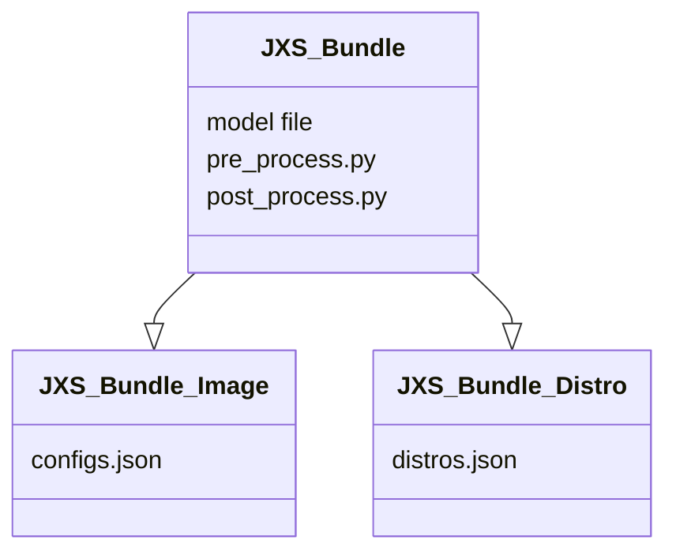

## Bundle

## Memory
```mermaid
classDiagram
    GlobalMemory <-- Runtime
    GlobalMemory <-- dict_FGs
    GlobalMemory <-- dict_BEs
    GlobalMemory <-- dict_Ps
    GlobalMemory <-- dict_Conns
    Runtime : PyObj codes
    Runtime : str dev_serial
    Runtime : bool debug
    Runtime : bool profile
    dict_FGs: [key]: bool
    dict_BEs: [key]: AbstractBackend
    dict_Ps: [key]: lambda
    dict_Conns: [key]: connections
    dict_BEs <-- BE1
    dict_BEs <-- BE2
```