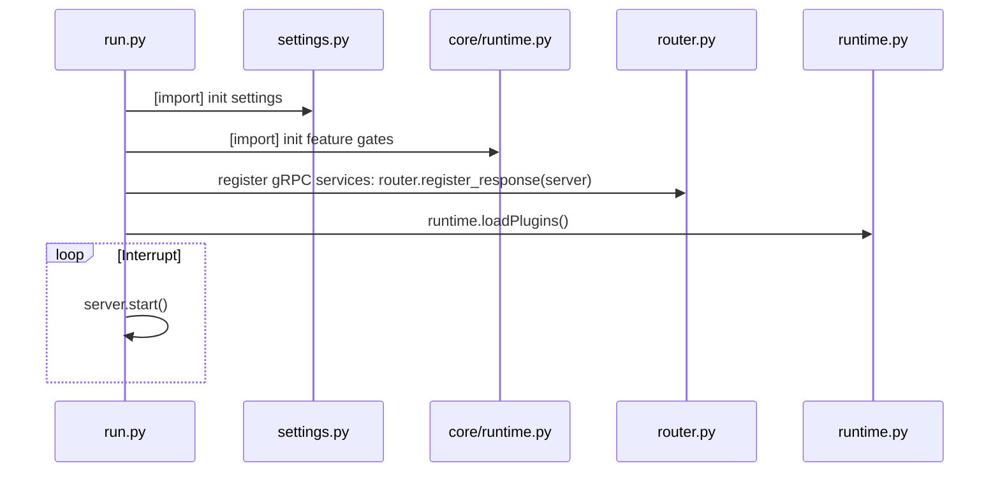

## Initial

```mermaid
sequenceDiagram
    run.py->>settings.py: [import] init settings
    run.py->>core/runtime.py: [import] init feature gates
    run.py->>router.py: register gRPC services: router.register_response(server)
    run.py->>runtime.py: runtime.loadPlugins()
    loop Interrupt
        run.py->>run.py: server.start()
    end
```