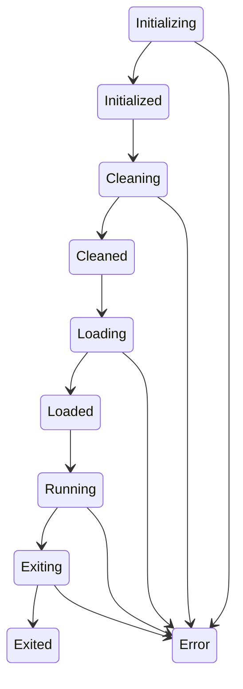
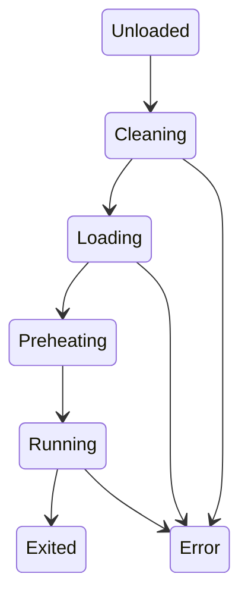

## Backend

```mermaid
stateDiagram
    Initializing --> Initialized
    Initializing --> Error
    Initialized --> Cleaning
    Cleaning --> Cleaned
    Cleaning --> Error
    Cleaned --> Loading
    Loading --> Loaded
    Loading --> Error
    Loaded --> Running
    Running --> Exiting
    Running --> Error
    Exiting --> Exited
    Exiting --> Error
```

## Model

```mermaid
stateDiagram
    Unloaded --> Cleaning
    Cleaning --> Loading
    Cleaning --> Error
    Loading --> Preheating
    Loading --> Error
    Preheating --> Running
    Running --> Exited
    Running --> Error
```