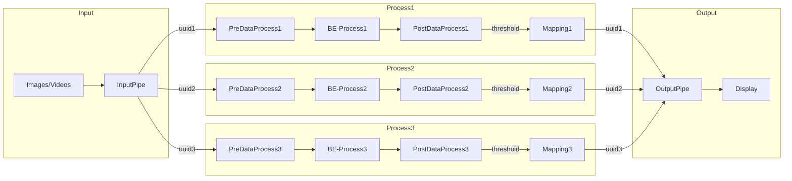

## Process

```mermaid
graph LR
    subgraph Input
    Images/Videos --> InputPipe
    end

    InputPipe --uuid1--> PreDataProcess1
    InputPipe --uuid2--> PreDataProcess2
    InputPipe --uuid3--> PreDataProcess3

    subgraph Process3
    PreDataProcess3 --> BE-Process3
    BE-Process3 --> PostDataProcess3
    PostDataProcess3 --threshold--> Mapping3
    end
    subgraph Process2
    PreDataProcess2 --> BE-Process2
    BE-Process2 --> PostDataProcess2
    PostDataProcess2 --threshold--> Mapping2
    end
    subgraph Process1
    PreDataProcess1 --> BE-Process1
    BE-Process1 --> PostDataProcess1
    PostDataProcess1 --threshold--> Mapping1
    end

    Mapping1 --uuid1--> OutputPipe
    Mapping2 --uuid2--> OutputPipe
    Mapping3 --uuid3--> OutputPipe

    subgraph Output
    OutputPipe --> Display
    end
```